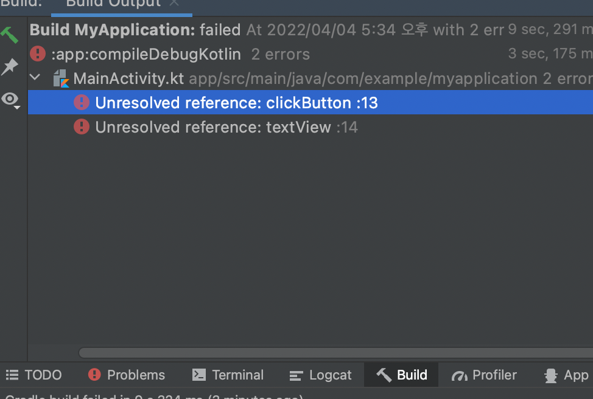

# [ Kotlin Study📱] Week 1: 1~3장 요약
## 1장 Android Stidio 설치
   - ⚠️ 35페이지 **HAXM 설치** 관련 -> 해당 설치가 뜨지않아 설치 못함
   - 그 외 설치 완료
## 2장 기기와 에뮬레이터 준비
  - 사용하지 않는 갤럭시 폰을 통해 기기 실행 완료
  - 에뮬레이터 실행 완료
## 3장 첫번째 앱 만들기
### 기본 화면 구성
  - **Android** : 안드로이드용으로 최적화된 모드
  - **Project** : 실제 폴더 구조대로 보는 모드. 위 모드일때 보이지 않는 파일 탐색
### 프로젝트 구조
  - **AndroidManifest.xml** : 앱 구성을 기술한 파일. 보통은 자동으로 작성되나 특정 작업을 하기 위해 앱에 권한을 추가할 때는 직접 편집. 앞으로 **매니페스트**라고 언급하면 이 파일을 가르키는 것.
  - **MainActivity.kt | activity_main.xml** : MainActivity.kt 파일에는 코드를 작성, activity_main.xml 파일에는 화면 레이아웃을 작성. 둘은 한 세트
  - **build.gradle** : 프로젝트 수준과 모듈 수준의 build.gradle 파일은 안드로이드 빌드 구성 파일 *(빌드 : 프로그램을 실행 가능한 상태로 만드는 과정)*
### 레이아웃 에디터
  1. **팔레트 창** : 레이아웃 디자인시 필요한 뷰 제공
  2. **컴포넌트 트리 창** : 레이아웃의 전체 구조 한눈에 볼 수 있음
  3. **디자인 창** : 뷰를 배치하여 레이아웃을 작성하는 화면
  4. **속성 창** : 속성을 설정할 수 있음
### 레이아웃 작성하기
  1. 텍스트 뷰 배치하기
  2. 문자열을 리소스로 만들기
  3. 다국어 추가하기
  4. 제약 수정하기
### 코드 작성하기 
  1. 액티비티
  2. 액티비티와 레이아웃 파일 간 전환 방법
  3. 버튼 배치하기
  4. 버튼 클릭시 이벤트 처리 방법
### ⚠️ 3장 문제점 
   - RUN할 시 아래 오류가 뜨는데, 코드를 다시보고 구글링을 해봐도 문제점이 무엇인지 모르겠음. -> activity_main.xml의 layout의 id를 수정함으로서 해결.

